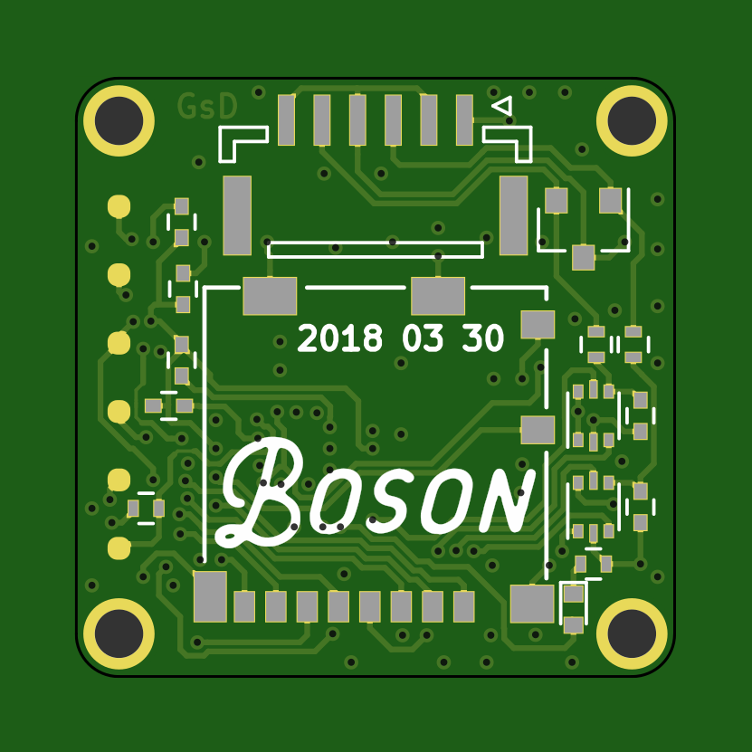

# bosonFrameGrabber v1.00

	Board Status: Discarded
	Note: bad footprint for HyperRam.

A Small FPGA based board. Designed to connect to a FLIR Boson Camera, and save images from the camera to a microSD card.

## Hardware

* ICE40HX8K in csBGA132 package
* HyperRAM: high density, but low pin count.
* QSPI Memory
* MicroSD socket
* MEMs Oscillator
* JST GH SM06 locking Data/Power connector
* JTAG exposed via pogo pin pads.
* 2x 5V tolerant I/Os on connector
* 1x LED!

Prototype Limitations:
* Not quite enough decoupling, not too close to BGA pads.
* 3.3V only! (Integrated LDOs handle FPGA rails, but input power is connected directly to the Boson)
* Non-ideal BGA footprint to reduce prototyping costs.

## Goals

I have not worked with FPGAs in a project before, This project is a toy project of mine, to learn while having a clear goal. 

* Use Icestorm toolchain to develop for FPGA
* Deploy a risc-V softcore into the HX8K.
* Develop a HyperRAM interface.
* Develop/Integrate SDMMC IP. (Intially SD in SPI mode)
* Save Images from the CMOS camera interface to the SD card.